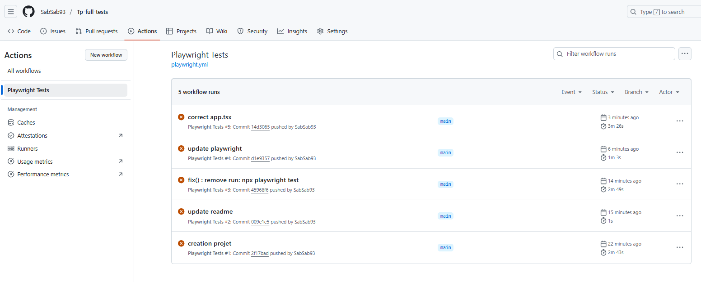
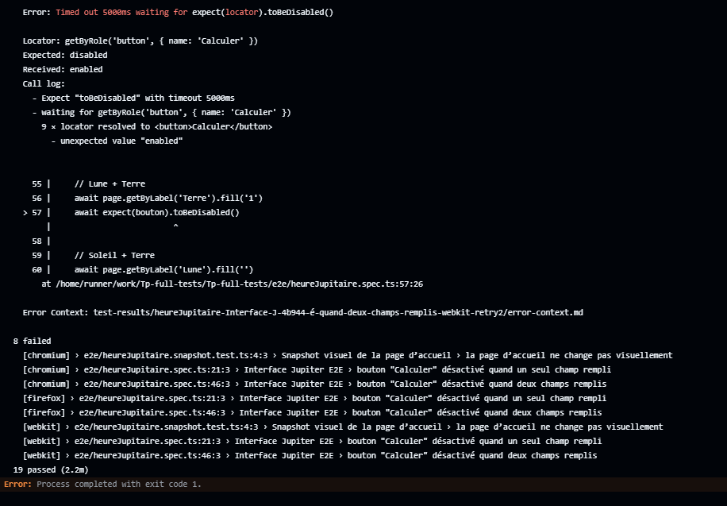
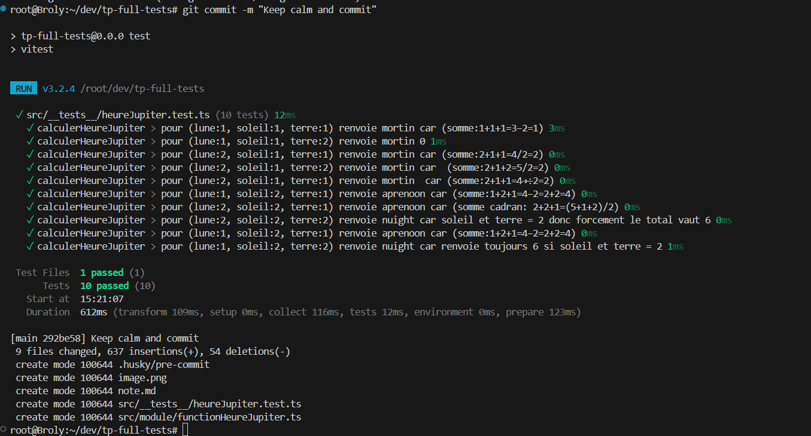
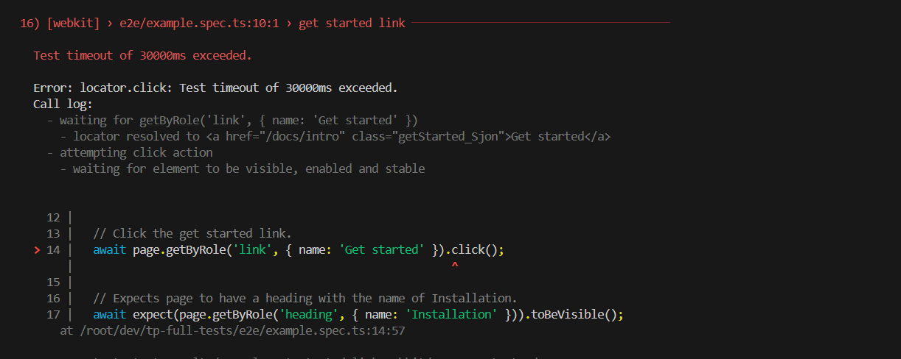

# React + TypeScript + Vite

## Projet du jour

### Clonage et installation
 ```bash 
 git clone <repo>
 cd <repo>
 npm install 
 ```

### Lancer l'Application
 ```bash 
npm run dev 
 ```

### Lancer les tests

#### Test unitaire 

- Manuellement
 ```bash 
npm run test
 ```
- Automatiquement
Grâce à Husky qui relance les test apres chaque commit


#### Test e2e

- Manuellement
  
```bash 
npm run e2e
 ```
- Automatiquement
Grâce à playwright.yml qui crée un workflow dans github à chaque push vers le main



Cela renvoie faux car il me semble que c'est la meme erreur qu'avec npm run e2e

---

## Partie test unitaire
En faisant le squelette on s'aperçoit rapidement que le code est plus simple dans le sens que deja si terre et soleil vaut 2 cela retroune 6

J'avais au depart des erreurs sur tout les tests ou lune=2 j'ai mis ma division au debut et non à la fin 

Passage des tests unitaires avec la commande suivante : 
 ```bash 
 npm run test
 ```


## Utilisation de Husky pour la mise en place de test pre commit
 Avec cette commande pour installer : 
 ```bash 
 npm install --save-dev husky
 ```


 Puis initialiser Husky 

  ```bash 
  npx husky init
 ```

Ainsi à cahque commit, il passe en revue tous les tests : 



Je n'ai pas vu le NB mais pour lancer les tests dans mon projet c'est npm run test


## Creation de l'interface 

Init Playwright
  ```bash 
  npx husky init
 ```

On peut lancer les tests e2e avec la commande suivante : 
  ```bash 
 npm run e2e
 ```
Mes tests en e2e ne fonctionne pas chez ces messages d'erreurs : 


