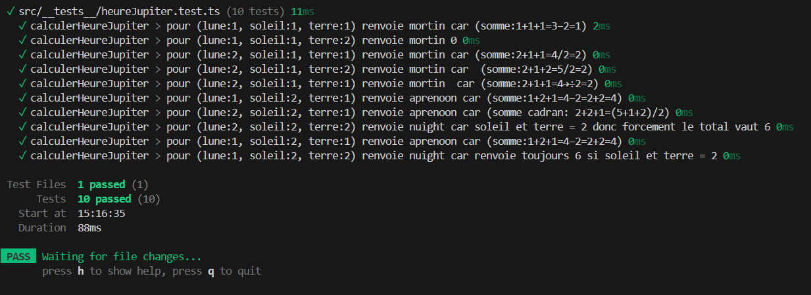

# React + TypeScript + Vite

## Partie test unitaire
En faisant le squelette on s'aperçoit rapidement que le code est plus simple dans le sens que deja si terre et soleil vaut 2 cela retroune 6

J'avais au depart des erreurs sur tout les tests ou lune=2 j'ai mis ma division au debut et non à la fin 

Passage des tests unitaires: 

## Utilisation de Husky pour la mise en place de test pre commit
